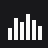
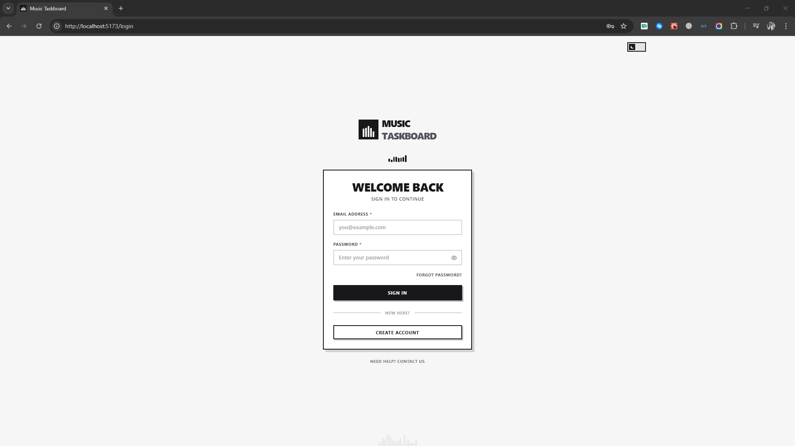

<div align="left">
  <div style="display: flex; align-items: center; justify-content: flex-start; gap: 20px; margin-bottom: 5px;">
    
    <h1 style="margin: 0; padding: 0;">Music Taskboard</h1>
  </div>
  <p style="margin: 0; padding: 0;">A comprehensive content production workflow management system for music releases.</p>
</div>
<br>
<div align="center">
  
</div>

## ⚙️ Technologies & Tooling

The **Music Taskboard** is built on the robust MERN stack, complemented by modern web development tools for a seamless and dynamic user experience.

<div align="center">
    
    
    
    
    
    
    
    
    
    
    
</div>

---
<br>

## » Project Description

The **Music Taskboard** is a powerful, web-based application designed to streamline and centralize the complex **content production workflow** for music releases and associated media.

This system provides a dedicated platform for coordinating tasks and information flow between multiple departments, including **Admin, Production, Music Engineering, Graphics, Video, and Marketing**.

### Core Functionality

* **Assignment Management:** Allows authorized users (Admin or Producers) to schedule various assignments: Music Release, Video Release, Graphic Design, and Marketing Campaigns.
* **Detailed Product Element Tracking:** Manages critical data points for each music release: **Release Date, Genre, BPM, Artist information, Mix Name, and Video Type**.
* **Automated Workflow Scheduling:** Manages a complex, date-driven workflow, automatically calculating and setting due dates for dependent tasks based on the content's type and initial release date.
* **Single Source of Truth:** Serves as the centralized repository for all production elements and scheduling statuses, improving accountability and clarity across teams.

---
<br>

## 🚀 Getting Started: Running the Application

This MERN stack application requires the backend API server and the frontend client to be run concurrently.

### Prerequisites (Installation)

Ensure the following dependencies are installed on your system. Links are provided for convenience.

| Dependency | Purpose | Download Link |
| :--- | :--- | :--- |
| **Node.js (LTS)** | JavaScript runtime environment (for both server and client) | [Download Node.js](https://nodejs.org/en/download/) |
| **MongoDB** | Database for storing application data | [Install MongoDB Community Server](https://www.mongodb.com/try/download/community) or [MongoDB Atlas (Cloud)](https://www.mongodb.com/cloud/atlas) |
| **Git** | Version control | [Download Git](https://git-scm.com/downloads) |

### Local Setup Steps

1.  **Clone the Repository**
    ```bash
    git clone [https://github.com/MIbrahimPro/Music-Production-Workflow.git](https://github.com/MIbrahimPro/Music-Production-Workflow.git)
    cd Music-Production-Workflow
    ```

2.  **Database Configuration**
    Set up your MongoDB connection:
    * **Local:** Ensure your local MongoDB server is running.
    * **Atlas:** Create a free cluster on [MongoDB Atlas](https://www.mongodb.com/cloud/atlas) and retrieve your connection string (URI).

3.  **Environment Variables**

    You need two `.env` files for configuration:

    | File Location | Variable | Purpose |
    | :--- | :--- | :--- |
    | `frontend/.env` | `VITE_API_URL` | Base URL for the frontend to connect to the backend. |
    | `backend/.env` | `MONGODB_URI` | The connection string for the MongoDB database. |
    | `backend/.env` | `JWT_SECRET` | A secret key used to sign JSON Web Tokens for authentication. |
    | `backend/.env` | `PORT` | The port on which the backend Express server will run. |

    **Example `backend/.env` (Choose One URI Style):**
    ```bash
    # Local MongoDB
    MONGODB_URI=mongodb://127.0.0.1:27017/musictaskboard 
    # OR MongoDB Atlas (Cloud)
    # MONGODB_URI=mongodb+srv://<username>:<password>@clustername/musictaskboard?retryWrites=true&w=majority

    JWT_SECRET=YOUR_STRONG_SECRET_KEY_HERE
    PORT=5000
    ```
    **Example `frontend/.env`:**
    ```bash
    VITE_API_URL=http://localhost:5000/api 
    ```

4.  **Run Backend Server**

    Open your terminal, navigate to the project `Music-Production-Workflow` folder, and run:
    ```bash
    cd backend
    npm install
    npm start 
    # API server running on http://localhost:5000
    ```

5.  **Run Frontend Client**

    Open a **second terminal window**, navigate to the project `Music-Production-Workflow` folder, and run:
    ```bash
    cd frontend
    npm install
    npm run dev 
    # Client running (typically on http://localhost:5173)
    ```
    Open your browser to `http://localhost:5173` to view the application.

### Production Build

Only execute these steps if you are preparing the application for a production environment. Running frontend and backend separately is sufficient for local testing and development.

1.  **Build the Frontend**
    ```bash
    cd frontend
    npm run build
    ```
    This command generates the optimized static files in the `frontend/dist` directory.

2.  **Deploy to Backend**
    The static files must be placed in a folder that your backend server is configured to serve (e.g., inside `backend/public` or similar).

---
<br>

## 📸 Screenshots

The following images illustrate key features and the user interface of the Music Taskboard application.
<br>

**[View All Screenshots and UI/UX Details Here](https://github.com/MIbrahimPro/Music-Production-Workflow/tree/main/Screenshots)** ---

<br>

---
<br>

## 🤝 Contributions

We highly value community involvement and welcome contributions to the Music Taskboard project.

* **Reporting Issues:** If you encounter bugs or have suggestions for new features, please submit a detailed report via the [Issues](https://github.com/MIbrahimPro/Music-Production-Workflow/issues) tab.
* **Code Contribution:** We encourage developers to **fork the repository**, create a dedicated branch for their changes, and submit a well-documented Pull Request (PR) for review.

## ⚖️ License

This project is open-source and released under the **MIT License**.

The MIT License is a permissive free software license that grants users the freedom to:
* Use and modify the software privately or commercially.
* Distribute copies of the software.

It requires that the original copyright and license notice are included in all copies or substantial portions of the software.

## 💸 Sponsor

*Support this project by sending funds to the following account:*

**Jazzcash Account:** `+923197877750`
**Account Holder:** `Muhammad Ibrahim`

---
<br>

## 📧 Contact

For professional inquiries or technical assistance, please reach out to:

* **Email:** mibrahimpro.1@gmail.com
* **Phone / WhatsApp:** +923197877750